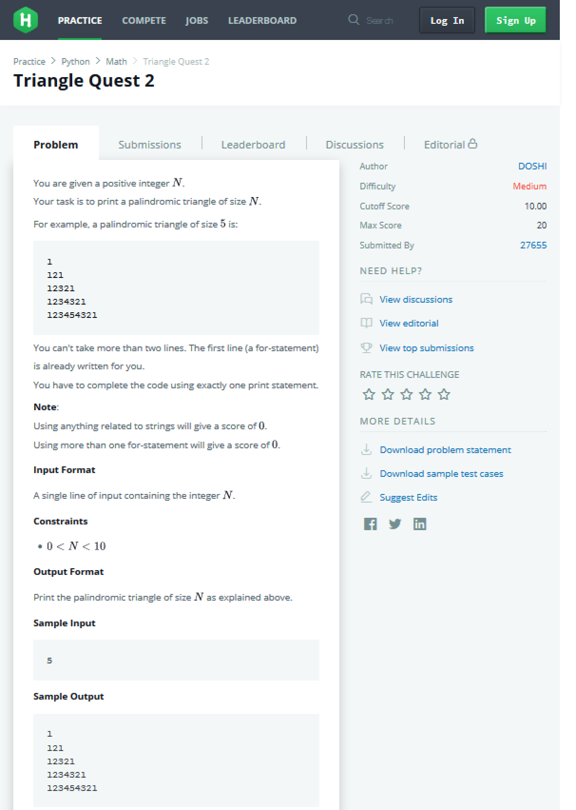
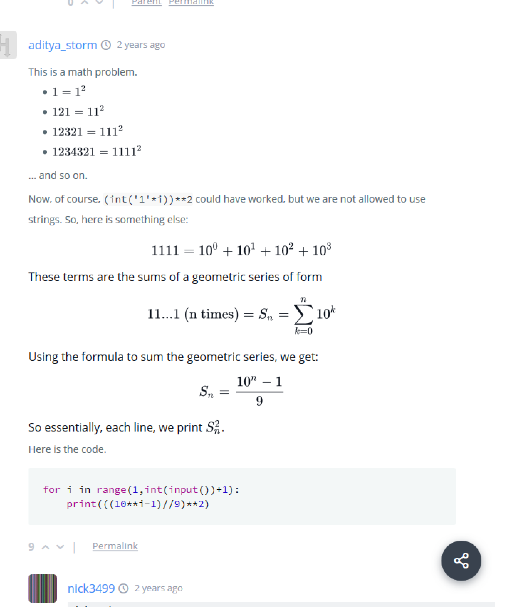

## HackerRank 11 TriangleQuest2 123454321 ⠀ also called ⠀ 'Demlo numbers'.
Python files contains solutions from discusion for the specific contest.<br>  Often the solution is broken appart for small pieces ⠀so we get break points ⠀in need to give the idea of steps taken by code in order to achieve the final solution.<br> Solutions are mostly grouped by their ideas. <br> Solutions are grouped by ideas they represent. <br>  Files are written in a Jupyter notebook manner:
``` python
''' Author of the solution ''',  ''' maybe some comment '''
python_code doing sth:
    pass
''' output of the code '''
```


It can be usefull to uncomment parts of prints ⠀and ⠀than the arrow ⠀ ` print("\n==========>\n") ` ⠀ pointing to the particular output.

In case of contest **` HackerRank 11 TriangleQuest2 123454321 `**  it contains all discusion comments from the beginning up to the date of scrapping  which was 2020-01-30.

In case of contest **` HackerRank 11 TriangleQuest2 123454321 `**  it contains all discusion comments from the beginning up to the date of scrapping  which was 2020-01-30.

Folder named ⠀` pictures* ` ⠀contains interesting screenshots from the discusion.


## And the contest topic is:



## And if you are not a Math Wizard ⠀` aditya_storm ` (and others) ⠀provided us some explanation for math shortcut:

